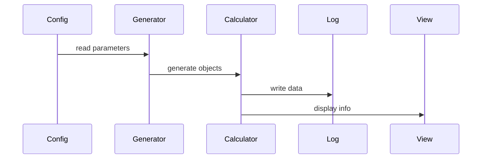

- [ ] Implementazione scheletro del programma e funzionamento
- [ ] Divisione dei compiti rispetto alle varie translational units
---
## Program flow

## TODO
- quantità di moto totale
- momento angolare totale
- eventuale stampa/salvataggio dati
- valutazione corretteza dati
- randomi input di dati
