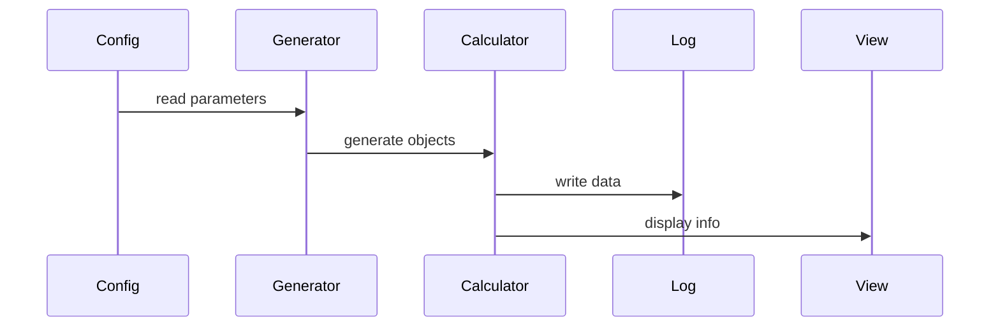

- [ ] Implementazione scheletro del programma e funzionamento
- [ ] Divisione dei compiti rispetto alle varie translational units
---
## Program flow

## Obiettivo: figura 8
file configurazione
TU lettura dati

TU corpi

TU generazione corpi

TU calcolo posizione

TU view
---