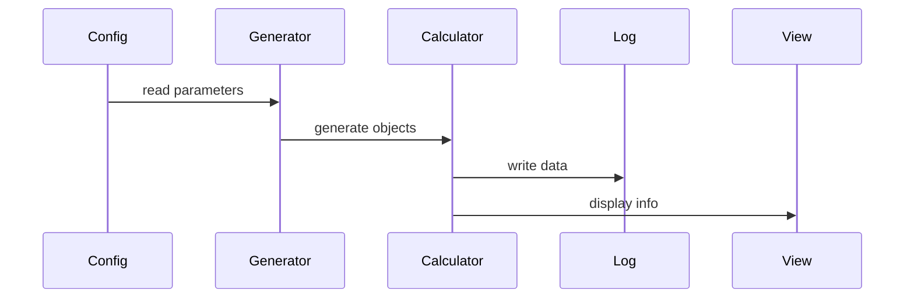

- [ ] Implementazione scheletro del programma e funzionamento
- [ ] Divisione dei compiti rispetto alle varie translational units
---
## Program flow

## TODO
simulation.hpp - Metodi fondamentali:
- calcolo accelerazioni
- step Velocity Verlet
- energia cinetica
- energia potenziale
- quantità di moto totale
- momento angolare totale
- eventuale stampa/salvataggio dati

Stampare su file CSV coordinate e energia ad ogni step.
Mostrare finestra grafica con le orbite dei corpi. 