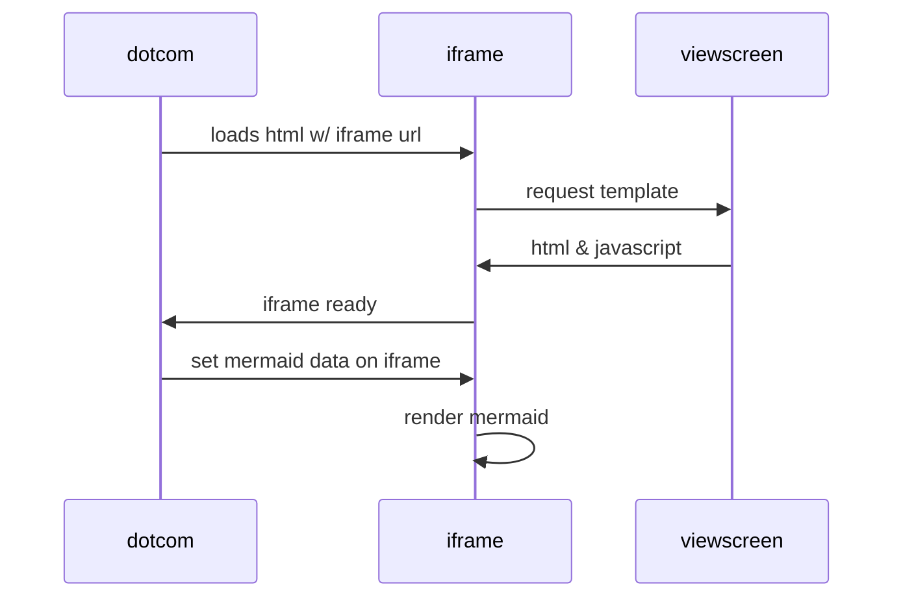

- [ ] Implementazione scheletro del programma e funzionamento
- [ ] Divisione dei compiti rispetto alle varie translational units
---
## Program flow

```mermaid
sequenceDiagram
    participant dotcom
    participant iframe
    participant viewscreen
    dotcom->>iframe: loads html w/ iframe url
    iframe->>viewscreen: request template
    viewscreen->>iframe: html & javascript
    iframe->>dotcom: iframe ready
    dotcom->>iframe: set mermaid data on iframe
    iframe->>iframe: render mermaid
```